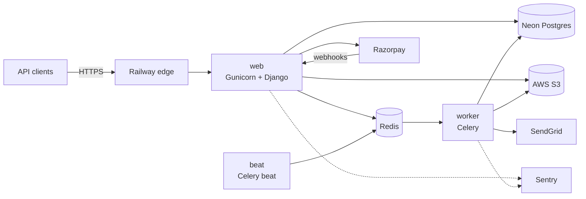

# Career Intelligence Platform

[](https://github.com/palakkayare/career-intelligence-platform/actions/workflows/ci.yml)
[](https://github.com/palakkayare/career-intelligence-platform/actions/workflows/build.yml)

A two-sided career platform backend: job seekers get resume parsing, job
matching and career guidance; recruiters get job posting, candidate discovery
and applicant management. Built with Django REST Framework, Celery and spaCy.

## Status

| | |
|---|---|
| Backend | **Deployed** to Railway (web, worker, beat), Neon Postgres, Redis, S3 |
| Frontend | Not built yet - this repository is the API |
| Payments | Razorpay integration complete, running in **test mode** |
| Launch | **Not launched.** Legal review, GSTIN and custom domain are outstanding |

The full picture - what is done, what is not, and the known tech debt - is in
[PROJECT_STATUS.md](PROJECT_STATUS.md).

## What it does

**Accounts and security** - email registration with OTP verification, JWT
auth, Google sign-in, TOTP two-factor with backup codes (secrets encrypted at
field level), login lockout, breached-password check, audit trail.

**Seekers** - profile, skills, education and experience; resume upload to S3,
spaCy parsing, ATS scoring with job-description match; job search on
PostgreSQL full-text search; applications with a status workflow.

**Recruiters** - company verification, job posting with moderation, candidate
discovery with masked profiles and credit-based contact reveal, talent pools.

**Matching** - weighted match score (skills, experience, location, salary),
recomputed asynchronously and cached.

**Career intelligence** - skill gap analysis with progress snapshots, learning
recommendations, career path engine on NetworkX, and salary insights published
only above a K-anonymity threshold.

**Also** - Razorpay orders, webhooks and GST invoices; plans, trials and
feature gating; in-app and email notifications with a daily digest; referrals;
company reviews with moderation; badges; interview preparation content; data
export and account closure.

## Numbers

Measured from the code, 11 Sep 2026.

| | |
|---|---|
| Django apps | 18 |
| Models | 67 |
| API routes | 175 |
| Automated tests | 1007 (CI fails below 80% coverage) |
| Celery tasks / scheduled jobs | 12 / 7 |
| Application code / test code | ~29,000 / ~13,000 lines of Python |

## Architecture



One Docker image runs all three services; `SERVICE_ROLE` picks the role
([docker/entrypoint.sh](docker/entrypoint.sh)).

## Tech stack

- **Backend:** Python 3.12, Django 5.2, Django REST Framework, SimpleJWT
- **Data:** PostgreSQL 16 (full-text search), Redis
- **Async:** Celery worker and beat
- **NLP and graphs:** spaCy, NetworkX
- **Integrations:** Razorpay, AWS S3, SendGrid, Google OAuth, Sentry
- **Delivery:** Docker (multi-stage, non-root), GitHub Actions, Railway

## Engineering practices

- **Tests:** 1007, run in CI against real Postgres and Redis service containers,
  with an 80% coverage gate. Regression tests are marked and name the bug they
  guard against.
- **Fast feedback:** black, isort and flake8 in pre-commit and in CI.
- **Secrets:** gitleaks scans the full git history on every push; reviewed
  findings are recorded with reasons in `.gitleaksignore`.
- **Safe configuration:** production refuses to start when a required setting
  is missing or points at localhost, and lists every problem at once.
- **Deploy verification:** `scripts/check_deploy.py` checks the running app -
  release, settings in force, client IP handling - after every deploy or
  rollback. See [DEPLOY.md](DEPLOY.md).
- **Observability:** structured JSON logs with request IDs; Sentry with
  personal data scrubbed.
- **Privacy:** a [data protection record](DATA_PROTECTION.md) prepared for
  legal review, and a [re-identification assessment](REIDENTIFICATION_ASSESSMENT.md)
  of the salary insights.

## Running locally

Requires Python 3.12, PostgreSQL 16 and Redis.

```bash
python3.12 -m venv venv
source venv/bin/activate
pip install -r requirements/development.txt -r requirements/test.txt
python -m spacy download en_core_web_sm

cp .env.example .env        # then fill in the blanks - see comments inside
python manage.py migrate
```

Seed reference data (safe to re-run, in this order):

```bash
python manage.py seed_skills
python manage.py seed_industries
python manage.py seed_categories
python manage.py seed_plans
python manage.py seed_target_roles
python manage.py seed_learning_resources
python manage.py seed_career_paths
python manage.py seed_badges
python manage.py seed_interview_prep
```

Run the app and a worker in two terminals:

```bash
python manage.py runserver
celery -A config worker --loglevel=info
```

Run the checks CI runs:

```bash
black --check . && isort --check-only . && flake8 .
pytest
```

`docker compose up` runs the full stack with **production** settings behind
nginx, so `.env` then needs the production-required variables as well.

## Documentation

| Document | What it covers |
|---|---|
| [PROJECT_STATUS.md](PROJECT_STATUS.md) | Done, not done, tech debt |
| [DEPLOY.md](DEPLOY.md) | Production layout, deploying, migrations, rollback |
| [DATA_PROTECTION.md](DATA_PROTECTION.md) | Personal data held, protections, open gaps |
| [REIDENTIFICATION_ASSESSMENT.md](REIDENTIFICATION_ASSESSMENT.md) | Privacy review of salary insights |
